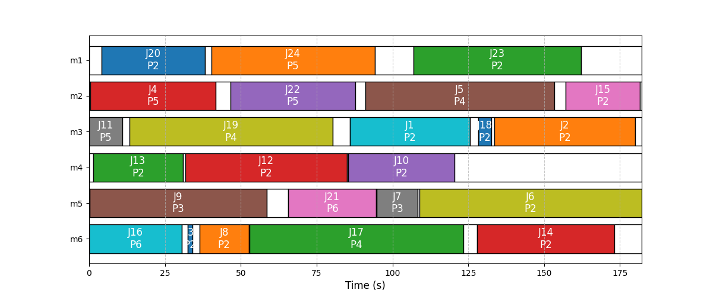

# Gantt Chart Plotter for Job Scheduling

This Python script generates a Gantt chart to visualize job schedules across multiple machines. It takes scheduling output data as input and produces a detailed graphical representation of job execution and idle times for each machine. The script also provides key schedule statistics such as the number of jobs, makespan, and total energy consumption.




## Input Format

The input is a multiline string containing scheduling data in the following format:
1. **Number of jobs** ($n$).
2. **Makespan** ($C_{max}$, in seconds).
3. **Total energy consumption** ($E$, in joules).
4. **Job details**, with each line specifying:
   - Job ID.
   - Machine ID.
   - P-State (power state).
   - Start Time (in seconds).
   - End Time (in seconds).

### Example Input

```plaintext
24
182.165143120
10909.758512185
1 3 2 85.944205423 125.581373469
2 3 2 133.655005921 180.050509839
3 6 2 32.456743487 34.081264166
...
```

## Output

The script generates:

**Gantt Chart**: 
   - Jobs are displayed as horizontal bars on a timeline.
   - Each bar is labeled with the Job ID (e.g., $J_1$) and P-State (e.g., $P_2$).
   - Idle times are shown as white gaps between job bars, highlighted with black borders.
   - Machines are represented on the y-axis, with time along the x-axis.

**Schedule Statistics**:
   - **Makespan** ($C_{max}$): Total duration of the schedule.
   - **Total energy consumption** ($E$): Total energy used (in joules).
   
   **Energy Formula**:
        $$
            E = \sum_{i=1}^m \sum_{j \in J_{m_i}} p_j o_j + \left( m C_{max} - \sum_{i=1}^n p_j \right) o_1
        $$
    Where:
- $p_j$: Processing time of job $j$.
- $o_j$: Power consumption during execution.
- $o_1$: Power consumption in the idle state.


## Example Usage

To use the script, call the `plot_gantt_chart` function with the scheduling data as input:
```python
plot_gantt_chart(instance_x_output)
```


## Purpose

Visualizing job schedules in scenarios where minimizing energy consumption and meeting makespan constraints are critical. It should help users identify idle times, optimize resource allocation and analyze energy efficiency in scheduling problems.